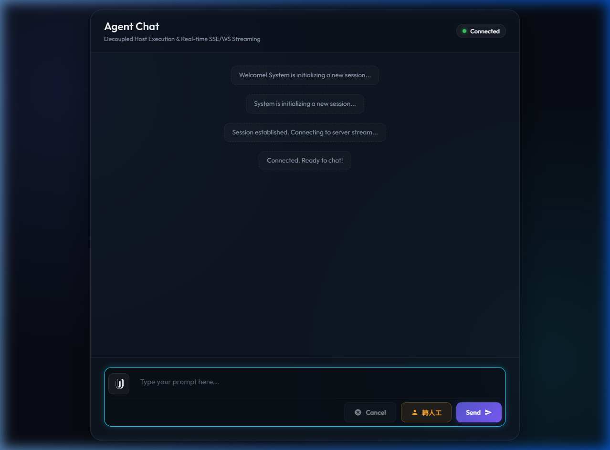

# rust-axum-agent-bridge

A lightweight, self-hosted chat bridge that connects a browser-based chat UI to any local AI CLI tool (Gemini, Claude, OpenAI, Copilot, etc.) with real-time streaming.



[English](#english) | [繁體中文](#繁體中文)

---

## English

A lightweight, self-hosted chat bridge that connects a browser-based chat UI to any local AI CLI tool (Gemini, Claude, OpenAI, Copilot, etc.) with real-time streaming.

### Architecture

```
Browser (WebSocket)
       │
       ▼
  Axum API Bridge  ◀──Poll/Progress──  Local Agent Daemon  ──spawn──▶  AI CLI Process
  (port 8080)                           (port 7456, local)            (agy / claude / openai…)
       │
       ▼
  SQLite (Tasks Table)
```

The system consists of two processes:

| Process | Role |
|---------|------|
| **Axum API Bridge** | Serves the chat UI, manages sessions in SQLite, queues execution tasks in SQLite, and pushes streaming tokens to the browser over WebSocket |
| **Local Agent Daemon** | Runs on the host machine, polls tasks from the API Bridge, spawns AI CLI child processes, and streams progress back via HTTP |

### Features

- 🔄 **Real-time token streaming** — Progress stream from Daemon → Axum → WebSocket to browser
- 🖼️ **Image attachments** — Base64 image upload, decoded and passed to the CLI
- 🧑‍💼 **Human-in-the-loop** — Operator can take over a session and type manual responses via the Daemon settings UI
- 🔀 **Multi-CLI support** — Switch between `agy`, `claude`, `openai`, `copilot` at runtime without restart
- 🗃️ **SQLite persistence** — Session and message history stored locally
- 🧹 **Auto session cleanup** — Background reaper expires idle/timed-out sessions and kills orphan processes
- ❌ **Run cancellation** — Cancel an in-progress CLI execution mid-stream
- 🐳 **Docker support** — Single `docker compose up` deployment

### Getting Started

#### Prerequisites

- [Rust](https://rustup.rs/) 1.78+
- At least one supported AI CLI installed and on your `PATH`:
  - [`agy`](https://github.com/your-org/agy) (default)
  - `claude`, `openai`, or `copilot`

#### Run Locally (Development)

Open two terminals:

**Terminal 1 — Start the Daemon:**
```powershell
.\run_daemon.ps1
# Daemon polls the API Bridge and listens on http://127.0.0.1:7456 for settings UI
```

**Terminal 2 — Start the API Bridge:**
```powershell
.\run_api.ps1
# API listens on http://localhost:8080
```

Open your browser at **http://localhost:8080**.

#### Run with Docker

```bash
# Start everything (API Bridge only; Daemon must run on host)
docker compose up -d --build
```

> **Note:** The Daemon must run on the host machine (not in Docker) because it needs to spawn local CLI processes. It polls the API Bridge container using the `BRIDGE_URL` environment variable.

```bash
# View logs
docker compose logs -f

# Stop
docker compose down
```

### Configuration

All configuration is via environment variables (or a `.env` file):

| Variable | Default | Description |
|----------|---------|-------------|
| `DATABASE_URL` | `sqlite:///data/sqlite/agent.db` | SQLite database path |
| `PORT` | `8080` | Port for the Axum API Bridge |
| `DAEMON_PORT` | `7456` | Port the Daemon listens on |
| `BRIDGE_URL` | `http://127.0.0.1:8080` | URL of the API Bridge that the Daemon connects to for task polling and progress reporting (set to your public domain when deploying remotely) |

#### CLI Path Overrides

The Daemon resolves CLI executables via environment variables:

| CLI Key | Env Variable | Default |
|---------|-------------|---------|
| `agy` | `AGY_CLI_PATH` | `agy` |
| `openai` | `OPENAI_CLI_PATH` | `openai` |
| `copilot` | `COPILOT_CLI_PATH` | `copilot` |
| `claude` | `CLAUDE_CLI_PATH` | `claude` |

#### Daemon Configuration

The active CLI is persisted to `daemon_config.json` in the project root:

```json
{
  "active_cli": "agy"
}
```

You can also change it at runtime via the Daemon settings UI at **http://localhost:7456**.

### API Reference

| Method | Endpoint | Description |
|--------|----------|-------------|
| `GET` | `/health` | Health check |
| `POST` | `/sessions` | Create a new chat session |
| `POST` | `/sessions/:id/messages` | Send a prompt (with optional image attachments) |
| `POST` | `/sessions/:id/cancel` | Cancel an in-progress run |
| `GET` | `/ws/:id` | WebSocket — subscribe to session token stream |

#### Message Payload

```json
{
  "content": "What is in this image?",
  "attachments": [
    {
      "mime_type": "image/png",
      "data": "<base64-encoded-image>"
    }
  ]
}
```

### Project Structure

```
src/
├── main.rs                    # Entry point (API Bridge or Daemon mode)
├── api/                       # HTTP routes and DTOs
│   ├── routes/
│   │   ├── sessions.rs        # Session and message endpoints
│   │   └── websocket.rs       # WebSocket endpoint
│   └── dto/
├── application/               # Business logic (services, ports, models)
│   ├── services/
│   │   ├── session_service.rs
│   │   ├── runtime_service.rs
│   │   └── cleanup_service.rs
│   ├── models/
│   └── ports/
└── infrastructure/            # Adapters (DB, Daemon client, WebSocket registry)
    ├── config/env.rs          # Environment config
    ├── db/                    # SQLite repositories
    ├── realtime/              # WebSocket registry
    └── runtime/               # Daemon client, process manager, settings UI

src/frontend/                  # Browser chat UI (HTML/CSS/JS)
```

### Tech Stack

- **[Axum](https://github.com/tokio-rs/axum)** — Async HTTP + WebSocket server
- **[Tokio](https://tokio.rs/)** — Async runtime
- **[SQLx](https://github.com/launchbadder/sqlx)** — SQLite with async support
- **[reqwest](https://github.com/seanmonstar/reqwest)** — SSE streaming HTTP client
- **[tower-http](https://github.com/tower-rs/tower-http)** — CORS, static file serving

### License

MIT

---

## 繁體中文

輕量、可自架的聊天橋接器，將瀏覽器聊天介面連接到任何本機 AI CLI 工具（Gemini、Claude、OpenAI、Copilot 等），支援即時串流輸出。

### 架架

```
瀏覽器（WebSocket）
       │
       ▼
  Axum API 橋接器  ◀──輪詢/進度回報──  本機 Agent Daemon  ──spawn──▶  AI CLI 程序
  （port 8080）                         （port 7456, 本機）           （agy / claude / openai…）
       │
       ▼
 SQLite (任務佇列資料表)
```

系統由兩個程序組成：

| 程序 | 職責 |
|------|------|
| **Axum API 橋接器** | 提供聊天 UI、以 SQLite 管理 Session、在 SQLite 中建立任務佇列，並以 WebSocket 將串流 Token 推送至瀏覽器 |
| **本機 Agent Daemon** | 執行在宿主機上，向 API 橋接器輪詢任務、啟動 AI CLI 子程序，並透過 HTTP 將執行進度串流回傳 |

### 功能特色

- 🔄 **即時 Token 串流** — Daemon → Axum（HTTP 進度回報）→ 瀏覽器（WebSocket）端對端串流
- 🖼️ **圖片附件** — 支援 Base64 圖片上傳，自動解碼後傳入 CLI
- 🧑‍💼 **人工介入（Human-in-the-loop）** — 客服人員可透過 Daemon 設定 UI 接管 Session，手動輸入回覆
- 🔀 **多 CLI 支援** — 執行期間切換 `agy`、`claude`、`openai`、`copilot`，無需重啟
- 🗃️ **SQLite 持久化** — Session 與訊息歷史本機儲存
- 🧹 **自動 Session 清理** — 背景任務定期清除閒置或逾時的 Session 並終止孤立程序
- ❌ **取消執行** — 可中途取消進行中的 CLI 執行
- 🐳 **Docker 支援** — 一行 `docker compose up` 即可部屬

### 快速開始

#### 前置需求

- [Rust](https://rustup.rs/) 1.78+
- 至少安裝一個支援的 AI CLI 並加入 `PATH`：
  - [`agy`](https://github.com/your-org/agy)（預設）
  - `claude`、`openai` 或 `copilot`

#### 本機開發執行

開啟兩個終端機：

**終端機 1 — 啟動 Daemon：**
```powershell
.\run_daemon.ps1
# Daemon 會向 API 橋接器輪詢任務，並在 http://127.0.0.1:7456 提供本地設定 UI
```

**終端機 2 — 啟動 API 橋接器：**
```powershell
.\run_api.ps1
# API 監聽於 http://localhost:8080
```

用瀏覽器開啟 **http://localhost:8080**。

#### 使用 Docker 部屬

```bash
# 啟動（僅 API 橋接器；Daemon 需在宿主機上執行）
docker compose up -d --build
```

> **注意：** Daemon 必須執行在宿主機（非 Docker 容器內），因為它需要在本機啟動 CLI 程序。Daemon 會使用 `BRIDGE_URL` 環境變數向 API 橋接器進行 Outbound 輪詢。

```bash
# 查看 log
docker compose logs -f

# 停止
docker compose down
```

### 設定

所有設定均透過環境變數（或 `.env` 檔案）提供：

| 變數 | 預設值 | 說明 |
|------|--------|------|
| `DATABASE_URL` | `sqlite:///data/sqlite/agent.db` | SQLite 資料庫路徑 |
| `PORT` | `8080` | Axum API 橋接器監聽 Port |
| `DAEMON_PORT` | `7456` | Daemon 本地設定服務監聽 Port |
| `BRIDGE_URL` | `http://127.0.0.1:8080` | Daemon 連接與輪詢 API 橋接器（Bridge）的 URL（遠端部屬時設為對外公網 domain） |

#### CLI 執行路徑覆寫

Daemon 透過環境變數解析 CLI 執行檔路徑：

| CLI 鍵值 | 環境變數 | 預設指令 |
|---------|----------|---------|
| `agy` | `AGY_CLI_PATH` | `agy` |
| `openai` | `OPENAI_CLI_PATH` | `openai` |
| `copilot` | `COPILOT_CLI_PATH` | `copilot` |
| `claude` | `CLAUDE_CLI_PATH` | `claude` |

#### Daemon 設定檔

目前啟用的 CLI 會持久化到專案根目錄的 `daemon_config.json`：

```json
{
  "active_cli": "agy"
}
```

也可在執行期間透過 Daemon 設定 UI（**http://localhost:7456**）即時切換。

### API 文件

| 方法 | 端點 | 說明 |
|------|------|------|
| `GET` | `/health` | 健康檢查 |
| `POST` | `/sessions` | 建立新的聊天 Session |
| `POST` | `/sessions/:id/messages` | 送出提示（可附帶圖片） |
| `POST` | `/sessions/:id/cancel` | 取消進行中的執行 |
| `GET` | `/ws/:id` | WebSocket — 訂閱 Session 的 Token 串流 |

#### 訊息 Payload 格式

```json
{
  "content": "這張圖片裡有什麼？",
  "attachments": [
    {
      "mime_type": "image/png",
      "data": "<base64-encoded-image>"
    }
  ]
}
```

### 專案結構

```
src/
├── main.rs                    # 進入點（API 橋接器或 Daemon 模式）
├── api/                       # HTTP 路由與 DTO
│   ├── routes/
│   │   ├── sessions.rs        # Session 與訊息端點
│   │   └── websocket.rs       # WebSocket 端點
│   └── dto/
├── application/               # 商業邏輯（服務、Port、模型）
│   ├── services/
│   │   ├── session_service.rs
│   │   ├── runtime_service.rs
│   │   └── cleanup_service.rs
│   ├── models/
│   └── ports/
└── infrastructure/            # 介面卡（DB、Daemon 客戶端、WebSocket 登錄表）
    ├── config/env.rs          # 環境設定
    ├── db/                    # SQLite Repository
    ├── realtime/              # WebSocket 登錄表
    └── runtime/               # Daemon 客戶端、程序管理、設定 UI
```

### 技術棧

- **[Axum](https://github.com/tokio-rs/axum)** — 非同步 HTTP + WebSocket 伺服器
- **[Tokio](https://tokio.rs/)** — 非同步執行環境
- **[SQLx](https://github.com/launchbadder/sqlx)** — 非同步 SQLite 支援
- **[reqwest](https://github.com/seanmonstar/reqwest)** — SSE 串流 HTTP 客戶端
- **[tower-http](https://github.com/tower-rs/tower-http)** — CORS、靜態檔案服務

### 授權

MIT
